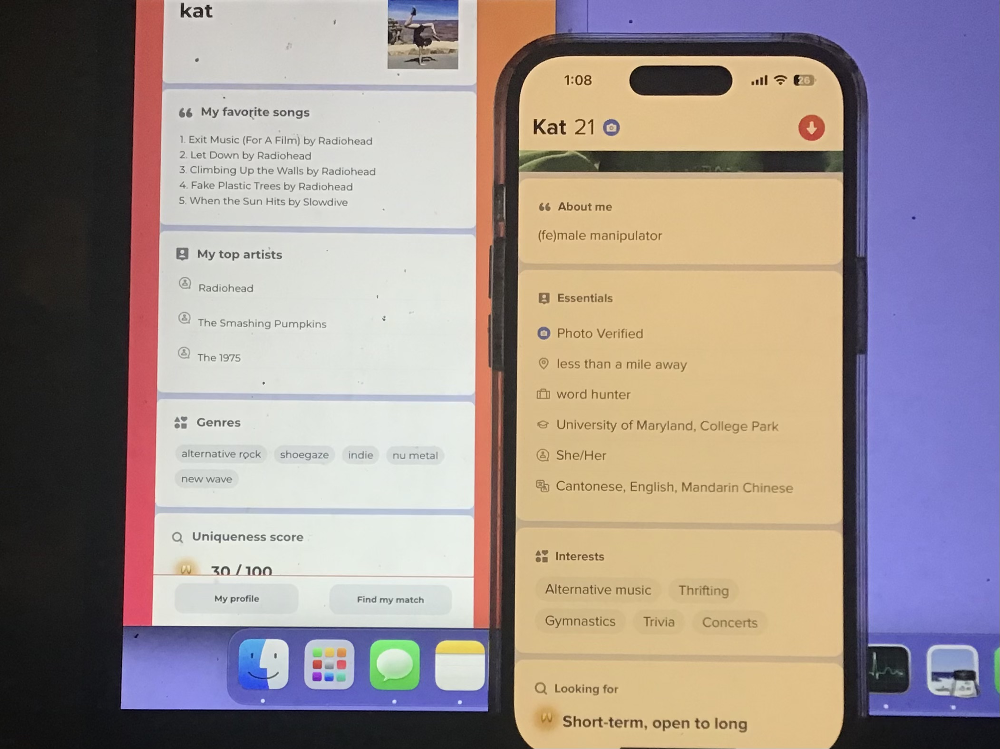
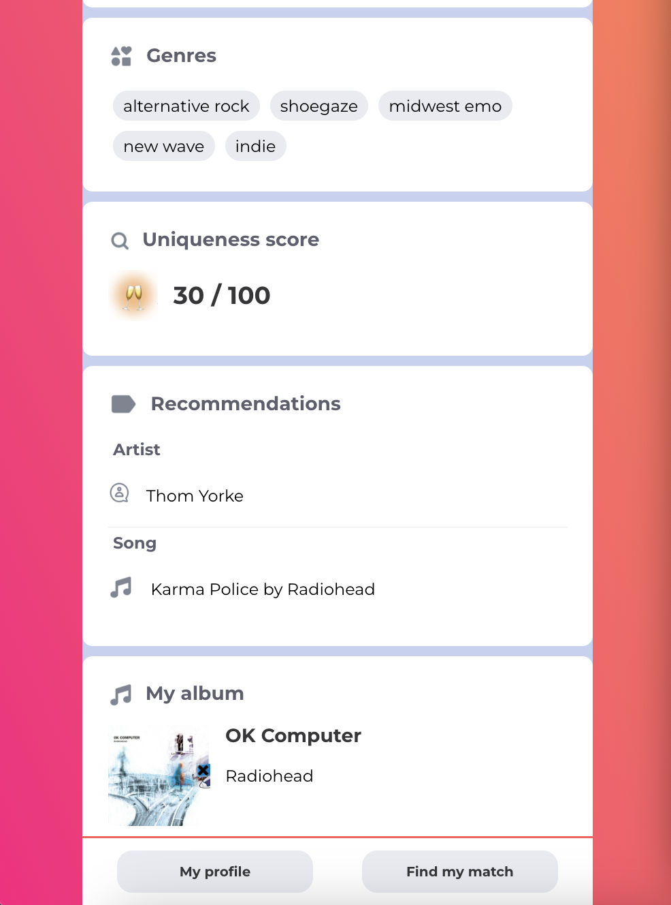

## About
Display your Spotify stats in a Tinder profile and compare your music taste with another person's.

## Demos
Side-by-side real Tinder UI:

Sample screens:

## How to use
<li> Ensure you have Flask, React, and Python installed
<li> Execute flask run in the backend sub-directory, and npm start in the frontend sub-directory
<li> Go to localhost:3000 in your browser
<li> Log into your Spotify account when prompted. You should see your Spotify stats.
<li> To compare with someone else, click Match on the bottom sidebar, and enter the URL of another playlist

## Tech
Frontend: React (HTML, CSS, Javascript)  
Backend: Flask (Python), API (Spotify, Last.fm)  
Old version (not compatible with new Spotify API): https://github.com/kath3rine/tinderfy

